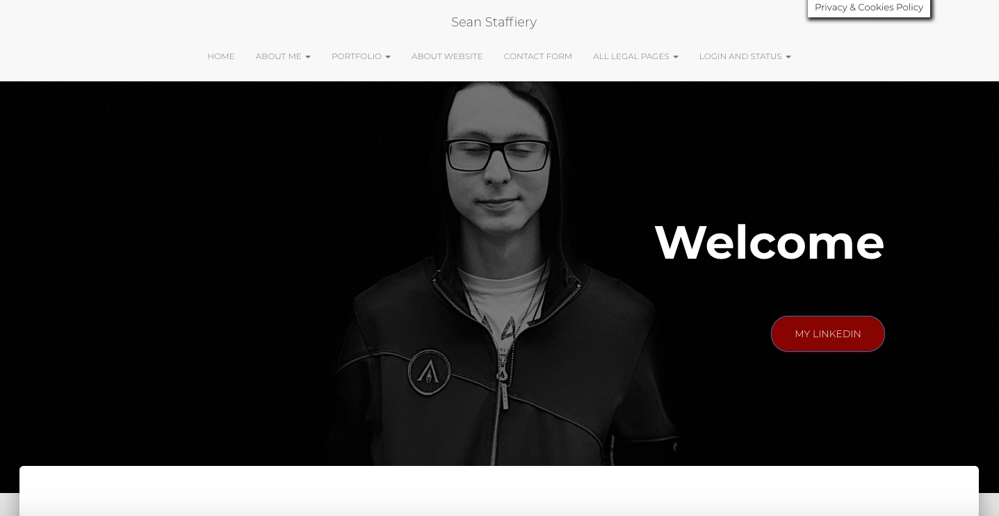

# Personal Website: seanstaffiery.com

Here you find a collection of code running on my website, from embeds for protocols like Open Graph, modified themes files (i.e. PHP code from functions.php), custom HTML, CSS, Javascript, PHP, and or Python. You can find also probable additions and/or untested code for my website here.

<strong>My Website</strong>

